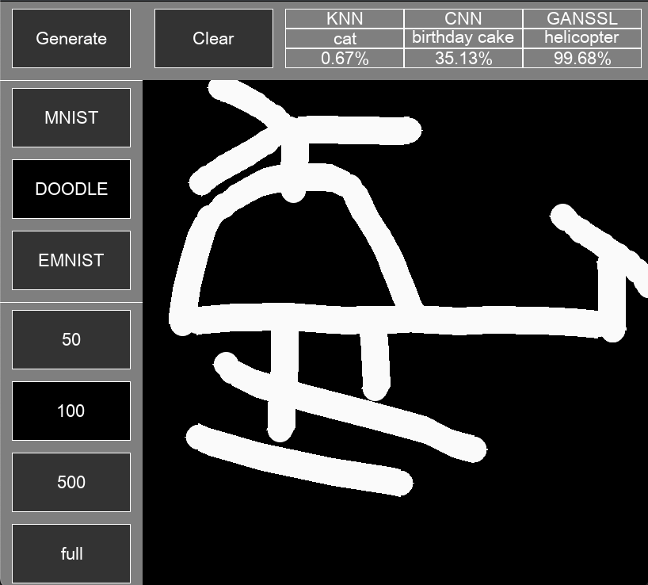
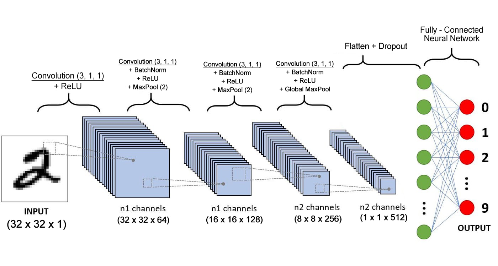
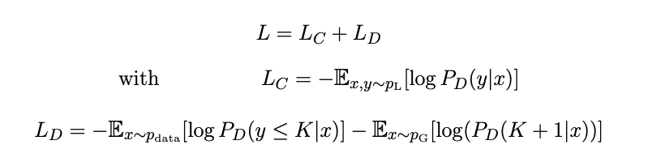
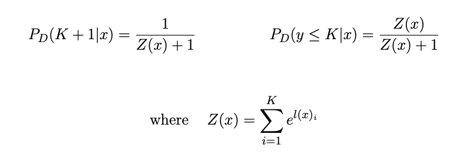

# GAN-based Semi-supervised learning for Image Classification
GAN-based Semi-supervised learning for Image Classification in 3 datasets: MNIST, DOODLE (subset of Quick, Draw! dataset with 10 classes) and EMNIST-letters with 3 algorithms: KNN, CNN and GAN-SSL

## Features
The project will allow you to draw digits on the canvas predicting in real-time image

There will be 3 datasets to choose from:
* MNIST: Handwritten digits
* DOODLE: subset of Quick, Draw with 10 classes namely: helicopter, car, book, windmill, cat, umbrella, octopus, bird, hat, birthday, cake
* EMNIST-letters: a-z alphabet both upper and lower letter

And for type of training:
* First 3 is when using 50, 100, 500 labelled data respectively for MNIST and DOODLE. 100, 200, 500 labelled data for EMNIST
* Last one is when using all data to train


<p align="center">
  
  
</p>


## Requirement
To run this project, you must have Python version >= 3.9 installed.

## How to use: 
To use this project using git, please do the following.
* Clone the repository's main branch into your desired directory using your git command prompt and access the directory by this command.

```git clone -b master https://github.com/trinhminh11/GAN-based-Semi-Supervised-Learning```

for lighter used (exlude KNN) used:

```git clone -b MT https://github.com/trinhminh11/GAN-based-Semi-Supervised-Learning```

for even lighter used (only app, without training and KNN) used:

```git clone -b demo https://github.com/trinhminh11/GAN-based-Semi-Supervised-Learning```

* access to the directory:

```cd GAN-based-Semi-Supervised-Learning```

* Install required libraries via requirements.txt

```pip install -r requirements.txt```

* Run the project with

```python main.py```

or 

```python3 main.py```

### Data Preporcessing
The above datasets' original dimensions are 28 x 28 x 1 RGB images. However, we will resize them to 32 x 32 x 1 images and adjust the pixel values from 0 to 255 to a range of -1 to 1.


### K-nearest neighbors
We will implement with euclidean distance with K = 3.


### Convolutional Neural network
The Architechture of CNN are represent as follow: 
<p align="center">
  
  
</p>

### GAN-based Semi-Supervised Learning
We use the same Architechture of CNN for Discriminator and using trained Generator and trained Discriminator with below Loss function mentiond in Improved Techniques for Training GANs (https://arxiv.org/abs/1606.03498):

<p align="center">
  
with
  
  
</p>


### Note

Because the data store in KNN are too large to upload to github, if you want to evaluate KNN when using all labelled data, you should run kNN.ipynb first for each USED_DATA set in config.py to get pickle file for KNN Algorithm